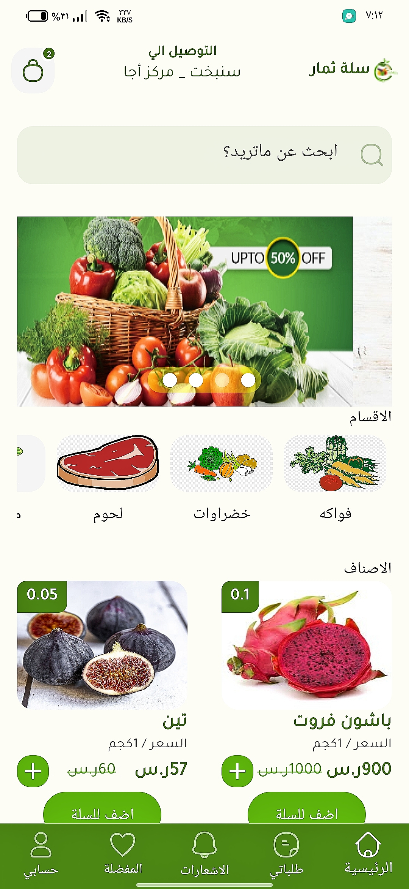

# thimar

A new Flutter project.

## 📖 Description  
-Developed a commercial app for browsing and purchasing fresh fruits and vegetables with an integrated shopping
cart and order tracking.
-Integrated REST APIs for product listings and order management, enhancing performance using BLOC for state
management.
-Implemented Google Maps for delivery location tracking and Cached Network Image for faster loading and reduced
data usage.

## 🛠️ Tech Stack  
- **Flutter** – Cross-platform framework  
- **Dart** – Programming language  
- **MVVM** – For scalable and maintainable code  
- **BLOC** – State management
- **Google Maps** – For embeding Google Maps in your applications
- **Geolocator** –  to get the user's current location, track location updates, and calculate distances  
- **Dio** – Making network requests
- **image_picker** – Select an image from Camera or Gellary
- **Shared Preferences** – Save data localy
- **Shimmer** – show a loading placeholder while data is being fetched

## 📸 Illustrative Image  

## 🎬 Demo    
[📹 Watch the demo](https://drive.google.com/file/d/1XKOMNZRfXqZfyTDsE1vK9FapfwJqQc-r/view?usp=drive_link)
